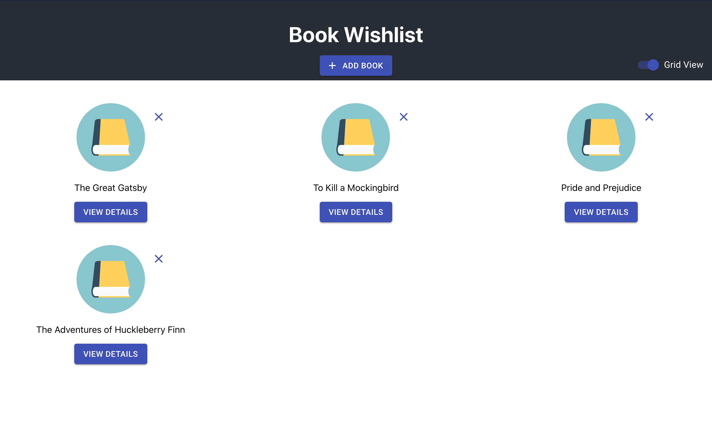

# book-wishlist
A single page app that stores a collection of books as a wishlist. Books can be added and removed from the list.

### Demo Data
There is some book data provided in the [bookData.js](bookData.js) file for demo purposes. You can use this data to pre-fill books into the wishlist. Follow the instructions in the comment on line 31 of App.js if you would like to use this data locally while viewing the application in development mode.

### Categories
A limited selection of book `categories` have been pre-defined within the [categories.js](categories.js) file. These categories are used to populate the select input within the `AddBookModal` component. New categories can be added to this file to further expand the category options.

## Available Scripts

In the project directory, you can run:

### `npm start`

Runs the app in the development mode. 
Open [http://localhost:3000](http://localhost:3000) to view it in the browser.

The page will reload if you make edits. 
You will also see any lint errors in the console.

### `npm test`

Launches the test runner in the interactive watch mode. 
See the section about [running tests](https://facebook.github.io/create-react-app/docs/running-tests) for more information.
